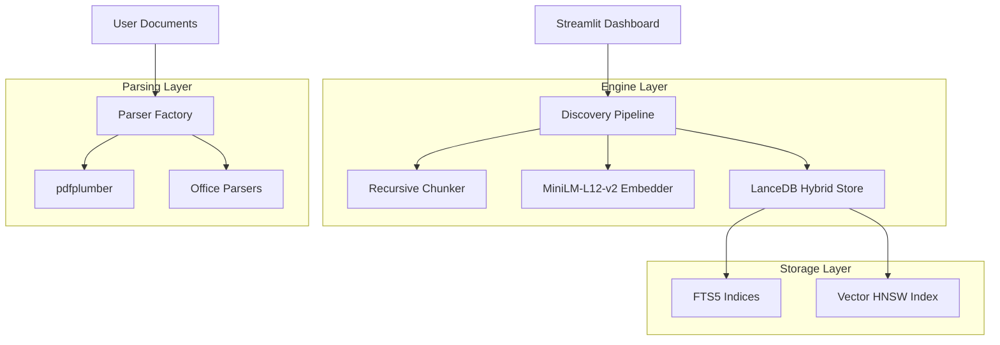

# Wo ist meine Doku - Lite (One-Click)

Your system has been optimized for Maximum Speed and Stability on your local PC.

## How to Start
1.  **First Time ONLY**: Double-click **`install.bat`**. 
    *   This will create a lightweight virtual environment and install exactly what you need for CPU mode.
2.  **To Use the App**: Double-click **`Launch-Doku.bat`**.
    *   This will start the dashboard and automatically open your web browser.

## Changes made for Lite Mode
-   **Engine**: Replaced heavy IBM Docling (~1.2GB RAM) with ultra-fast `pdfplumber`.
-   **No More Freezing**: Stripped memory-intensive AI parsers and LangChain dependencies to ensure stable performance on any PC.
-   **Recursive Chunking**: Switched to a zero-ML splitting logic that is 100x faster during ingestion.
-   **Model**: Using high-efficiency `paraphrase-multilingual-MiniLM-L12-v2`. It is optimized for 50+ languages and runs instantly on CPU.
-   **Reveal in Explorer**: Added a "Reveal" button to results to instantly open file locations in Windows.
-   **Night Clay (Dark Mode)**: Added a dynamic theme toggle for high-fidelity dark mode experience.
-   **Native Folder Picker**: Added a visual directory selection tool in the sidebar for effortless document ingestion.

## Data
-   Place your documents (PDF, DOCX, XLSX, PPTX) in the `data/raw` folder.
-   Click **"Sync & Re-index"** inside the app to process them.

---
*Wo ist meine Doku v1.0 — 100% Offline | GDPR Compliant | Professional Architecture*

---

# Wo ist meine Doku

**Local Semantic Discovery Engine for Private Documents**

Find precisely what you need by *meaning*, not just keywords. No matter where it is hidden in your local files.

**English** | [Deutsch](README_DE.md)

---

## Overview

Wo ist meine Doku is a high-performance, professional-grade discovery engine designed for legal professionals, researchers, and technical auditors who need 100% offline document analysis. It utilizes state-of-the-art embedding models and vector databases to index your local PC, allowing you to query documents with natural language and find exact paragraphs instantly.

- **Zero Data Leakage**: Operations are strictly local. No cloud, no external servers.
- **High Fidelity**: Specialized in German legal (§) and technical requirements.
- **Stability**: Optimized for standard Windows hardware (CPU-only).

---

## Key Features

### Semantic Content Discovery
Automatically index folders and subfolders. Search for concepts like "Fire safety regulations for inner-city residential areas" rather than just "fire safety". The system understands context and finds relevant paragraphs across thousands of files.

### Hybrid Retrieval
Combines high-performance Full-Text Search (FTS5) with Semantic Vector Similarity. This ensures that exact keyword matches are found as reliably as conceptual matches.

### UI/UX: Clay Design System
A handcrafted "Clay" aesthetic featuring warm cream canvases (Night Clay for dark mode), tactile hover animations, and hard offset shadows. Includes a **Reveal in Explorer** button and a **Native Folder Picker** for intuitive navigation.

### Ultra-Lite Parsing (NEW)
Uses high-speed, CPU-efficient parsers (`pdfplumber`) to extract text from documents instantly without loading heavy neural layout engines. This eliminates the system freezing previously caused by complex AI parsing.

### Multi-Format Support
Powerful parsers handle a wide array of document types with preservation of document structure.

| Format | Extensions | Notes |
|------|--------|------|
| Portable Document | `.pdf` | Structured text extraction |
| Word Processing | `.docx` `.doc` | Structural hierarchy preserved |
| Spreadsheets | `.xlsx` `.xls` | Cell-level row/column tracking |
| Presentations | `.pptx` | Slide-based semantic indexing |
| Plain Text | `.txt` `.md` | Automated encoding detection |

---

## Installation & Deployment

### 1. Prerequisites
- **Windows 10/11 x64**
- **Python 3.10 or higher**
- RAM: 8GB (minimum), 16GB (recommended)
- Disk: 1GB available space for indices and models

### 2. Setup
Double-click **`install.bat`** in the root directory.
This will:
- Create a local virtual environment.
- Install the **FastEmbed** library and ONNX Runtime (CPU-optimized).
- Download the embedding model (~150MB, one-time operation).

### 3. Launch
Double-click **`Launch-Doku.bat`** to start the Discovery Dashboard.
Your browser will open automatically to `http://localhost:8501`.

---

## Security & Data Privacy

The system is designed for maximum compliance and data sovereignty. When AI features are disabled, there is **zero network communication**.

| Feature | Data Location | External Transmission |
|------|------------|----------|
| Ingestion & Indexing | Local SQLite / LanceDB | None |
| Semantic Search | Local Vector Index | None |
| Embedding Operations | Local ONNX/Torch Model | None |
| Document Preview | In-memory Cache | None |
| Telemetry | Disabled | None |

---

## Architecture

| Component | Technology Stack |
|------|------|
| **Interface** | Streamlit |
| **Orchestration** | Python 3.10+ |
| **Vector Engine** | LanceDB (LCA) |
| **Embeddings** | FastEmbed (paraphrase-multilingual-MiniLM-L12-v2) |
| **Parsing** | pdfplumber / python-docx / openpyxl |
| **Inference** | ONNX Runtime (CPU-Optimized) |

---

## License & Support

Copyright 2025-2026 Wo ist meine Doku. Developed by the Antigravity Agent.

- **Developer**: sungwoo.kim@gmx.de
- **Repository**: [Regen99/Wo-ist-meine-Doku](https://github.com/Regen99/Wo-ist-meine-Doku)

For support, bug reports, or enterprise legal integration inquiries, please contact the developer via email.
