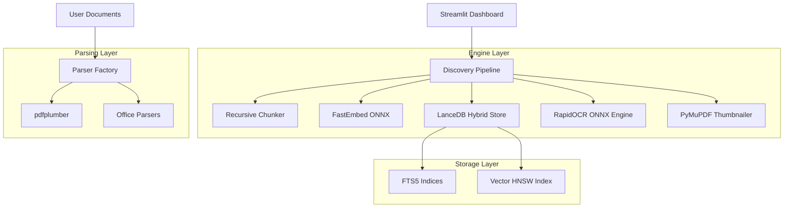

# Wo ist meine Doku - Lite (One-Click)

Your system has been optimized for Maximum Speed and Stability on your local PC.

## How to Start
1.  **First Time ONLY**: Double-click **`install.bat`**. 
    *   This will create a lightweight virtual environment and install exactly what you need for CPU mode.
2.  **To Use the App**: Double-click **`Launch-Doku.bat`**.
    *   This will start the dashboard and automatically open your web browser.

### Key Innovations in v1.3.10
-   **Folder-Aware Discovery**: Added a "Current Folder Only" search toggle. Restrict your search to the active project path instantly without re-indexing.
-   **Engine Speed**: Replaced heavy dependencies with ultra-fast ONNX-based **FastEmbed**.
-   **Multimodal Raw Ingestion**: Native support for **.md, .txt, .csv, and .log** files.
-   **Professional UX**: "Warm Enterprise" design with light/dark mode support and unified high-contrast elements.
-   **Robust State Management**: Decoupled widget keys from internal state to prevent "StreamlitAPIException" and ensure a seamless folder-browsing experience.
-   **No More Freezing**: Stripped memory-intensive AI parsers and LangChain dependencies to ensure stable 100% offline performance.

## Data
-   Place your documents (PDF, DOCX, XLSX, PPTX, **TXT, MD, CSV**) in any folder.
-   Select the folder in the Nav bar and click **"🔄 Sync & Index"**.

---
*Wo ist meine Doku v1.3.10 — 100% Offline | GDPR Compliant | Professional Architecture*

---

# Wo ist meine Doku

**Local Semantic Discovery Engine for Private Documents**

Find precisely what you need by *meaning*, not just keywords. No matter where it is hidden in your local files.

**English** | [Deutsch](README_DE.md)

---

## Overview

Wo ist meine Doku is a high-performance, professional-grade discovery engine designed for legal professionals, researchers, and technical auditors who need 100% offline document analysis. It utilizes state-of-the-art embedding models and vector databases to index your local PC, allowing you to query documents with natural language and find exact paragraphs instantly.

- **Zero Data Leakage**: Operations are strictly local. No cloud, no external servers.
- **High Fidelity**: Specialized in German legal (§) and technical requirements.
- **Stability**: Optimized for standard Windows hardware (CPU-only).

---

## Key Features

### Semantic Content Discovery
Automatically index folders and subfolders. Search for concepts like "Fire safety regulations for inner-city residential areas" rather than just "fire safety". The system understands context and finds relevant paragraphs across thousands of files.

### Folder-Filtered Search (NEW)
Focus your search on specific projects. Use the "Current Folder Only" toggle to filter results to the active directory shown in your navigation bar. Perfect for working with multiple client folders simultaneously.

### Hybrid Retrieval
Combines high-performance Full-Text Search (FTS5) with Semantic Vector Similarity. This ensures that exact keyword matches are found as reliably as conceptual matches.

### ONNX-OCR (INTEGRATED)
Enables search in scanned PDFs or "image-only" documents. The system uses the **RapidOCR engine** (ONNX-based) to automatically recognize text when no native text layer is found. Perfect for digitizing paper archives.

### Visual Previews
Each PDF search result can now be expanded to show a **high-fidelity thumbnail** of the first page. This allows for instant visual confirmation before fully opening the document.

### Multi-Project Favorites & Favorites
Manage multiple document sources and switch between different project folders via the top toolbar. The system remembers your favorite paths and the last used directory for a seamless workflow.

### UI/UX: Warm Enterprise Design
A high-fidelity professional interface featuring a warm beige backdrop, tactile "White Box" interactive elements with high-contrast black borders, and unified color synchronization for all dropdowns, tooltips, and document previews.

---

### Multi-Format Support
Powerful parsers handle a wide array of document types with preservation of document structure.

| Format | Extensions | Notes |
|------|--------|------|
| Portable Document | `.pdf` | Incl. OCR for scans & visual previews |
| Word Processing | `.docx` `.doc` | Structural hierarchy preserved |
| Spreadsheets | `.xlsx` `.xls` | Cell-level row/column tracking |
| Presentations | `.pptx` | Slide-based semantic indexing |
| Plain Text | `.txt` `.md` `.csv` `.log` | Direct string-based parsing |

---

## Installation & Deployment

### 1. Prerequisites
- **Windows 10/11 x64**
- **Python 3.10 or higher**
- RAM: 8GB (minimum), 16GB (recommended)
- Disk: 1GB available space for indices and models

### 2. Setup
Double-click **`install.bat`** in the root directory.
This will create a local virtual environment and install all dependencies.

### 3. Launch
Double-click **`Launch-Doku.bat`** to start the Discovery Dashboard.
Your browser will open automatically to `http://localhost:8501`.

---

## Security & Data Privacy

The system is designed for maximum compliance and data sovereignty. Operations are 100% offline.

| Feature | Data Location | External Transmission |
|------|------------|----------|
| Ingestion & Indexing | Local SQLite / LanceDB | None |
| Semantic Search | Local Vector Index | None |
| Embedding Operations | Local ONNX Model | None |
| OCR Operations | Local ONNX Engine | None |
| Document Preview | In-memory Cache | None |
| Telemetry | Disabled | None |

---

## Architecture

| Component | Technology Stack |
|------|------|
| **Interface** | Streamlit |
| **Orchestration** | Python 3.10+ |
| **Vector Engine** | LanceDB (SQL + Vector) |
| **Embeddings** | FastEmbed (paraphrase-multilingual-MiniLM-L12-v2) |
| **Parsing** | pdfplumber / python-docx / openpyxl |
| **Inference** | ONNX Runtime (CPU-Optimized) |

---

## License & Support

Copyright 2025-2026 Wo ist meine Doku. Developed by the Antigravity Agent.

- **Developer**: sungwoo.kim@gmx.de
- **Repository**: [Regen99/Wo-ist-meine-Doku](https://github.com/Regen99/Wo-ist-meine-Doku)

For support, bug reports, or enterprise legal integration inquiries, please contact the developer via email.
