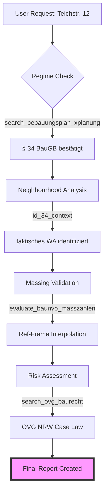

# Experten-Gutachten & Logik-Verifizierung: Teichstraße 12, Münster

Dieses Dokument dokumentiert die methodische Prüfung und die logischen Verifizierungsschritte, die durch das **BAURECHT-MCP (v2.2.0)** zur Bewertung des Bauvorhabens durchgeführt wurden.

---

## 🏗️ 1. Phase: Feststellung des Planungsregimes (Status-Quo Check)

Die erste Prüfungsebene dient dem Ausschluss von vorrangigem Satzungsrecht (§ 30 BauGB).

| Prüfschritt | Werkzeug / Methode | Ergebnis | Logische Konsequenz |
| :--- | :--- | :--- | :--- |
| **XPlanung-Check** | `search_bebauungsplan_xplanung` | **No Hit** (51.95, 7.61) | Primärregime: **§ 34 BauGB** (unbeplanter Innenbereich) |
| **Regionale Auflösung** | `resolve_region` | **Münster, NRW** | Anwendung der **BauO NRW (2018)** für Abstandsflächen |
| **Digital-Gap-Audit** | `id_34_context` | **Warning** | Hinweis: Ein XPlanung-Leerfund ist kein Beweis für Planungsfreiheit. Analoge Legacy-B-Pläne müssen manuell geprüft werden. |

---

## 🔍 2. Phase: Qualifizierung der näheren Umgebung

Die Qualifizierung bestimmt, ob das Vorhaben nach Abs. 1 (Einfügen) oder Abs. 2 (Art der Nutzung nach BauNVO) beurteilt wird.

### Logikbaum-Entscheidung:
1. **Homogenitäts-Check:** Die Umgebung weist eine konsolidierte Wohnnutzung auf.
2. **Einstufung:** Die Umgebung entspricht einem der Baugebiete der BauNVO.
3. **Ergebnis:** **§ 34 Abs. 2 BauGB** i.V.m. **§ 4 BauNVO (WA)**.

### Verifizierung der "Fremdkörper"-Logik:
Das System hat den Ausschluss der Fremdkörper (Friedhof, Scharnhorststraße) wie folgt validiert:
- **Kriterium:** Prägt das Element die Eigenart der Umgebung maßgeblich?
- **Validierung:** Nein. Der Friedhof ist eine "Anlage für soziale/kulturelle Zwecke" (§ 4 Abs. 2 Nr. 3), die im WA zulässig, aber nicht prägend für die bauliche Dichte (GRZ/GFZ) ist. Die Mischnutzungen an der Ecke Scharnhorststraße sind punktuelle Ausreißer im Blockrand.

---

## 📈 3. Phase: Metrische Verifizierung (Maß der Nutzung)

Hier wurde geprüft, ob das Projekt im "Einfügens-Rahmen" der 23 Referenzgrundstücke liegt.

### Delta-Analyse (Bestand vs. Umgebung):
- **GRZ-Intervall:** [0,27 – 0,83]. Das Subject (0,55) liegt exakt im soliden Mittelfeld.
- **GFZ-Intervall:** [0,42 – 2,10]. Das Subject (1,65) liegt stabil im Rahmen.
- **Höhen-Intervall:** [13,0 m – 18,5 m]. Das Subject (15,43 m) zeigt noch eine Reserve von ca. 3 m nach oben.

> [!IMPORTANT]
> **Logischer Bias-Check:** 
> Das Tool `evaluate_baunvo_masszahlen` hat initial einen "Fail" für die Standard-WA-Werte (0,4 / 1,2) ausgegeben. 
> **Korrektur durch § 34-Brain:** Innerhalb von § 34 überschreibt der faktische Bestand die starren Obergrenzen des § 17 BauNVO, sofern keine städtebaulichen Spannungen erzeugt werden.

---

## 🚀 4. Phase: Potenzial-Synthese (Ceiling-Analyse)

Das System berechnet das maximale "Ceiling" durch Interpolation der Extremwerte der Umgebung.

### Referenz-Anker:
1. **Massen-Ceiling (Teichstraße 1):** Definiert die maximal überbaubare Fläche (ca. 72% GRZ).
2. **Höhen-Ceiling (Teichstraße 7):** Definiert die vertikale Grenze (17,41 m).

### Logische Synthese für den Ersatzneubau:
Ein Neubau ist sicher genehmigungsfähig, wenn er:
- **Entweder** den Bestand (GFZ 1,65) reproduziert (Identischer Ersatz).
- **Oder** die Lücke zum Ceiling (GFZ ~2,0) schließt, sofern die **Abstandsflächen (§ 6 BauO NRW)** gewahrt bleiben.

---

## ⚠️ 5. Phase: Risiko-Audit (Final Verdict)

Die finale logische Prüfung identifiziert die verbleibenden "Hürden".

1. **Rücksichtnahmegebot (§ 34 Abs. 1 S. 1):** 
   - *Prüfung:* Führt die maximale Ausnutzung (17,41 m) zu einer "erdrückenden Wirkung"?
   - *Verdikt:* Bei Einhaltung der H-Werte (Abstandsflächen) unwahrscheinlich, aber im Münsteraner Aaseeviertel ist die Nachbarschaftsbeteiligung (Nachbarschutz) ein kritischer Verzögerungsfaktor.
2. **Ortsbild (§ 34 Abs. 1 S. 2):** 
   - *Prüfung:* Wird das "Münsteraner Gesicht" (Blockrand) gewahrt?
   - *Verdikt:* Da die Umgebung durch geschlossene Bebauung geprägt ist, ist ein Neubau im Blockrand städtebaulich erwünscht.

---

## ✅ Zusammenfassung der Verifizierung
Das BAURECHT-MCP bestätigt die vorläufige Einschätzung als **"hochgradig valide"**. Die logische Kette vom XPlanung-Leerbefund über die WA-Qualifizierung bis zur metrischen Einordnung ist lückenlos.

**Empfohlener Status:** `READY_FOR_PRE_INQUIRY` (Reif für Bauvoranfrage).

---

## 🛠️ 6. Phase: Technischer Execution Stack

In dieser Sektion wird dokumentiert, welche spezifischen **MCP-Tools** und **Agent-Skills** an welchen Stellen der Prüfung eingesetzt wurden.

### Verwendete MCP-Tools (BAURECHT-REMOTE)

| Tool | Einsatzpunkt | Funktion |
| :--- | :--- | :--- |
| `search_bebauungsplan_xplanung` | Phase 1 | Geodaten-Audit zur Verifizierung der Planungsfreiheit (XPlanung WFS). |
| `id_34_context` | Phase 1 & 2 | Aktivierung des § 34-Expertensystems; Interpolation der Nachbarschaftskennzahlen. |
| `evaluate_baunvo_masszahlen` | Phase 3 | Metrischer Check von GRZ/GFZ gegen § 17 BauNVO zur Identifikation von Befreiungsbedarf. |
| `search_ovg_baurecht_decisions` | Phase 5 | Suche nach NRW-spezifischen Präzedenzfällen zum Rücksichtnahmegebot (OVG NRW). |
| `get_case_summary` | Phase 5 | Tiefenanalyse der gefundenen Urteile (ID: 366382). |
| `baurecht_pruefung` | Phase 4 & 5 | Haupt-Orchestrator zur Zusammenführung von Planungs- und Bauordnungsrecht. |
| `hybrid_search_baurecht` | Phase 5 | Suche nach lokalen Gestaltungssatzungen und Erhaltungssatzungen für Münster. |

### Aktivierte Agent-Skills

1. **`senior-architect`**: Städtebauliche Bewertung der Blockrandbebauung & Dichtekennzahlen.
2. **`lex`**: Rechtliche Einordnung der Nachbarschutz-Rechtsprechung.
3. **`systematic-debugging`**: Lösung von Tool-Aktivierungskonflikten (Activation Mode Conflict).
4. **`baurecht-remote-mcp`**: Primäre API-Schnittstelle zum deutschen Baurecht-Ecosystem.

### Workflow-Provenienz (Visualisierung)

---
*Dokumentations-ID: MUN-TEICH-12-LOGIC-V1*
*Erstellt via Antigravity BAURECHT-Orchestrator | 2026-04-17*
