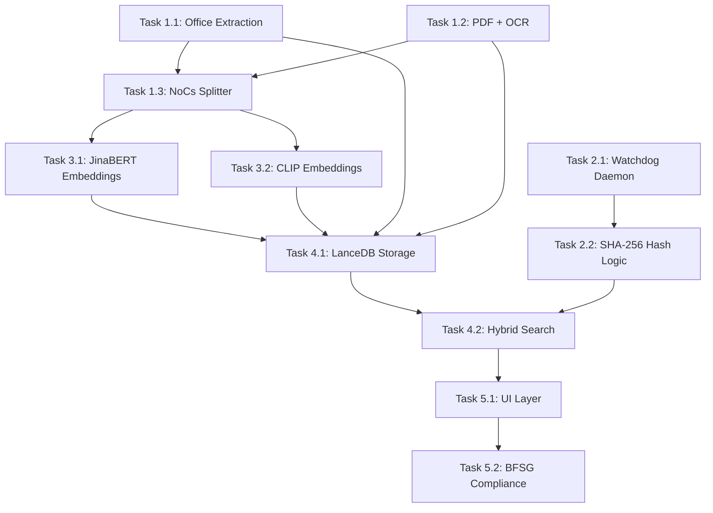

# [SUPERSEDED] Pre-Development Planning Report
> [!CAUTION]
> **This document is STALE.** It describes the original "Senior Insight" plan using heavy Docling/PyTorch dependencies. 
> The project has been refactored into **"Wo ist meine Doku" (Turbo-Lite)** using FastEmbed/ONNX.
> Refer to [Status Report](status_report.md) for current state.

# Pre-Development Planning Report
## Integrated Multimodal Semantic Search System — DACH Desktop Edition

| Field | Detail |
|---|---|
| **Report Date** | 2026-04-17 |
| **Project Codename** | Senior Insight |
| **Report Type** | Pre-Development Planning (Phase 0) |
| **Source References** | `research.md` (Architectural Blueprint) · `Jira.md` (Technical Backlog) |
| **Status** | DRAFT — Pending Stakeholder Sign-off |

---

## 1. Executive Summary

This report delivers the Phase 0 development plan for **Senior Insight**, a fully local, privacy-first semantic search system designed for German-speaking (DACH) desktop users. The system enables "one-search" retrieval across heterogeneous file formats — PDF, PPTX, XLSX, DOCX, and images — using deep vector embeddings, German-specific NLP, and an embedded hybrid search engine.

The research phase identified five critical architectural pillars:

1. **German-aware linguistic preprocessing** (Komposita-Zerlegung, umlaut normalization)
2. **Multimodal local document extraction** (Office + PDF/OCR pipeline)
3. **Long-context semantic vectorization** (JinaBERT + CLIP)
4. **Serverless embedded hybrid search** (LanceDB + BM25 Reciprocal Rank Fusion)
5. **EU-compliant DACH-specific frontend** (BFSG/BITV 2.0 accessibility)

All five pillars have corresponding Jira Epics with defined acceptance criteria, forming the basis for sprint planning.

---

## 2. Problem Statement

> [!IMPORTANT]
> The core problem: German desktop users cannot effectively retrieve information from their own locally stored heterogeneous documents using existing keyword-based tools.

Standard file search systems fail in three compounding ways:

| Failure Mode | Root Cause | Impact |
|---|---|---|
| **Semantic blindness** | Keyword matching cannot capture meaning | "Steuerbescheid" does not retrieve "Abgabenbescheid" |
| **German morphology gap** | No compound splitting | "Schiff" does not match "Schifffahrtsgesellschaft" |
| **Cloud dependency** | AI search relies on remote APIs | Violates GDPR for sensitive corporate/legal documents |

---

## 3. Project Objectives

| ID | Objective | Success Metric |
|---|---|---|
| OBJ-01 | Achieve sub-500ms semantic query response for local corpora up to 100K documents | P95 latency benchmark on dev machine |
| OBJ-02 | Support all major German office document formats | Pass all format acceptance criteria in Epic 1 |
| OBJ-03 | Enable zero-downtime incremental index updates | 0 cold-start restarts per 8-hour session |
| OBJ-04 | German-English cross-lingual search accuracy ≥ NDCG@10 of 0.75 | Evaluation dataset benchmark |
| OBJ-05 | Full BFSG/BITV 2.0 accessibility compliance before product release (BFSG effective since June 2025) | Lighthouse accessibility score ≥ 90 |
| OBJ-06 | 100% local processing — zero data leaves the device | Network trace audit (0 outbound API calls during search) |

---

## 4. Technology Selection Rationale

### 4.1 German NLP Layer

The compound splitting challenge is the primary German-specific technical risk. Three candidate tools were evaluated:

| Tool | Accuracy | Overhead | Decision | Rationale |
|---|---|---|---|---|
| **NoCs** (Stack-and-Buffer) | Highest (5+ constituents) | Medium (requires Stanza) | ✅ **SELECTED** | Best recursive depth for legal/technical terms |
| CharSplit | 95% head detection | Lightweight | Backup / ensemble | Limited to 3 constituents by default |
| German-Compound-Splitter (Aho-Corasick) | Dictionary-bound | Minimal | Supplemental | Accuracy capped by dictionary coverage |
| Apertium-deu (Finite State Transducers) | Deep morphological | High | ❌ **REJECTED** | Architectural overhead too high for embedded desktop deployment; FST integration layer adds >500ms cold-start [research.md ref 8] |

**Rationale:** NoCs handles the recursive depth required for legal and technical German terminology (e.g., *Bauordnungsrechtsgenehmigungsverfahren*). The Stanza dependency is acceptable given desktop environment constraints.

**Umlaut strategy:** Dual-token indexing (original + ASCII variant) to prevent over-normalization artifacts on Latin-derived words.

### 4.2 Document Extraction Layer

| Format | Selected Library | Fallback | Key Reason |
|---|---|---|---|
| Office (docx/xlsx/pptx) | `sharepoint-to-text` | `python-pptx` direct | Pure Python; no Java/LibreOffice |
| PDF (native) | Docling | pymupdf | Reading order + formula preservation |
| PDF (scanned) | RapidOCR (ONNX) | Tesseract | Dependency-free quantized inference |
| Images | RapidOCR / PaddleOCR | — | Screenshot-grade accuracy |

> [!NOTE]
> Docling replaces Apache Tika to avoid JVM runtime dependency, which is incompatible with the local-only, zero-installation deployment target.

### 4.3 Embedding Model Selection

| Model | Params | Context | Use Case | Status |
|---|---|---|---|---|
| `jina-embeddings-v2-base-de` | 161M | 8,192 tokens | Long German document RAG | ✅ Primary |
| `clip-ViT-B-32-multilingual-v1` | Variable | 77 tokens | Image-text multimodal search | ✅ Primary |
| `EmbeddingGemma-300m` | 308M | 2,048 tokens | Mobile / edge fallback | ⬜ Candidate |
| `multilingual-E5-base` | 110M | 512 tokens | Short query asymmetric retrieval | ⬜ Candidate |

**MRL (Matryoshka Representation Learning):** Applied to JinaBERT output to enable truncation from 768D → 256D for initial coarse retrieval, reducing disk I/O before precision re-ranking.

### 4.4 Vector Database

**LanceDB selected** over Chroma and SQLite-vss.

| Criterion | LanceDB | Chroma | SQLite-vss |
|---|---|---|---|
| Disk-based (>RAM datasets) | ✅ IVF-PQ | ❌ In-memory fallback | ⚠️ Partial |
| Hybrid search (BM25 + Vector) | ✅ Native | ❌ Manual integration | ❌ Manual |
| Serverless embedded | ✅ | ✅ | ✅ |
| Production scalability | ✅ | ⚠️ Degrades >500K | ✅ |

**Hybrid retrieval algorithm:** Lexical BM25 score + Cosine semantic score fused via **Reciprocal Rank Fusion (RRF)**:

```
RRF(d) = Σ 1 / (k + rank_i(d))   where k = 60
```

### 4.5 Chunking Strategy

> [!IMPORTANT]
> Chunking defines the fundamental retrieval unit. Every downstream system (embedding, indexing, search ranking) depends on this specification.

The system uses **format-aware semantic chunking** rather than naive fixed-size splitting:

| Document Type | Chunking Boundary | Overlap | Metadata Preserved |
|---|---|---|---|
| **PDF** | Page boundary (Docling structural unit) | 2 sentences cross-page | Page number, section heading, source file path |
| **PPTX** | Slide boundary | None (slides are atomic) | Slide number, slide title, speaker notes (separate chunk) |
| **XLSX** | Row group (max 50 rows per chunk) | Column header repeated per chunk | Sheet name, header row, cell coordinates |
| **DOCX** | Paragraph or heading-delimited section | 1 paragraph overlap | Section heading hierarchy, paragraph index |
| **Images** | 1 image = 1 chunk | N/A | File path, EXIF metadata (if available), OCR text |

**Chunk size target:** 256–512 tokens per chunk (optimized for JinaBERT's 8,192-token window to allow batch embedding of 16 chunks per inference call).

**Chunk-to-source linkage:** Each chunk carries a `ChunkMetadata` object:
```
{
  "source_file": "absolute_path",
  "chunk_index": int,
  "structural_unit": "page|slide|row_group|section",
  "structural_id": "page_3" | "slide_12" | "rows_51_100",
  "parent_heading": "optional section title",
  "sha256": "file-level hash for incremental sync"
}
```

### 4.6 Minimum Hardware Specification

The following baseline defines the minimum viable environment for local operation:

| Component | Minimum | Recommended | Notes |
|---|---|---|---|
| **OS** | Windows 10 21H2 / macOS 12 / Ubuntu 22.04 | Windows 11 24H2 | Primary target: Windows desktop |
| **CPU** | 4 cores (x86-64, AVX2 support) | 8 cores | ONNX runtime requires AVX2 for quantized inference |
| **RAM** | 8 GB | 16 GB | JinaBERT (161M) + CLIP (ViT-B-32) peak ~3.5 GB combined |
| **Storage** | SSD, 2 GB free (index) | NVMe SSD, 10 GB free | LanceDB IVF-PQ benefits from fast random reads |
| **GPU** | Not required | CUDA 11.8+ (optional) | CPU-only inference path is default; GPU accelerates batch indexing |
| **Python** | 3.10 | 3.11 | 3.12 supported but watchdog has known edge cases |

> [!NOTE]
> "Low-spec machine" in Risk R-04 is now defined as: 4-core CPU, 8 GB RAM, HDD (no SSD). At this baseline, JinaBERT loads in ~8s (vs. ~2s on recommended spec) and ONNX INT8 quantized fallback is automatically activated.

---

## 5. Epic & Task Breakdown

### Epic 1 — Smart Multimodal Document Parsing & Structural Pipeline

**Goal:** Build a parsing system that preserves document layout and metadata beyond raw text.

| Task ID | Task Name | Priority | Owner/Role | Core Technology | Acceptance Criteria | Estimated Effort |
|---|---|---|---|---|---|---|
| **1.1** | Pure-Python Office Extraction | **P0** | Backend Engineer | `sharepoint-to-text` | .docx/.xlsx/.pptx/.doc/.xls support; Excel column header serialization | 3 days |
| **1.2** | Layout-Aware PDF Parsing + OCR | **P0** | Backend Engineer | Docling + RapidOCR | Output in structural units (pages/slides); auto-OCR fallback on scanned PDF | 4 days |
| **1.3** | German Compound Word Splitter | **P0** | NLP Engineer | NoCs (Stack-and-Buffer) | Compounds ≤ 5 constituents decomposed correctly; integrated in preprocessing pipeline | 3 days |

**Dependencies:** Task 1.1 and 1.2 are parallel. Task 1.3 depends on 1.1 and 1.2 completion (requires tokenized output from both pipelines).

**Risk:** Docling API stability — mitigation: pin version, maintain pymupdf fallback.

---

### Epic 2 — Zero-Downtime Background Incremental Indexing (Live Sync)

**Goal:** Continuously monitor local directories and synchronize changes in real-time without user interruption.

| Task ID | Task Name | Priority | Owner/Role | Core Technology | Acceptance Criteria | Estimated Effort |
|---|---|---|---|---|---|---|
| **2.1** | Filesystem Watcher Daemon | **P1** | Backend Engineer | `watchdog` (Python) | Detect Create/Update/Delete events; graceful error handling | 2 days |
| **2.2** | SHA-256 Hash Incremental Update | **P1** | Backend Engineer | Custom hash registry | Skip unchanged files; route modified files through full pipeline | 2 days |

**Architecture Note:** The hash registry persists in SQLite alongside the LanceDB store. Update complexity is O(U) where U = number of modified files, not O(N) total.

**Risk:** High-frequency file change events (e.g., autosave) causing indexing storms — mitigation: debounce event queue with 5-second cooldown window.

---

### Epic 3 — Optimized Multimodal Vectorization for Embedded Environments

**Goal:** Deploy local embedding models supporting German/English cross-lingual queries and image search.

| Task ID | Task Name | Priority | Owner/Role | Core Technology | Acceptance Criteria | Estimated Effort |
|---|---|---|---|---|---|---|
| **3.1** | Long-Context German Embedding | **P0** | ML Engineer | `jina-embeddings-v2-base-de` + MRL | 8,192-token context; 768D → 256D truncation supported; model loads in <3s on recommended spec | 3 days |
| **3.2** | Multimodal Image-Text Embedding | **P1** | ML Engineer | `clip-ViT-B-32-multilingual-v1` | German text query → image cosine similarity search functional | 3 days |

**Dependencies:** Both tasks are independent. Shared embedding runner abstraction required before integration.

**Risk:** VRAM/RAM pressure on low-spec devices — mitigation: ONNX quantized exports for both models, CPU-only inference path.

---

### Epic 4 — Zero-Dependency Embedded Hybrid Search Engine

**Goal:** Design a database architecture that runs within the local application context without an external server.

| Task ID | Task Name | Priority | Owner/Role | Core Technology | Acceptance Criteria | Estimated Effort |
|---|---|---|---|---|---|---|
| **4.1** | Serverless Vector Storage | **P0** | Backend Engineer | LanceDB + IVF-PQ | All vectors + metadata in single container; offline-only; IVF-PQ index for >10K docs | 3 days |
| **4.2** | Hybrid BM25 + Semantic Search | **P0** | Backend + ML Engineer | LanceDB FTS + RRF | Parallel BM25 + vector search; top-10 RRF reranking; P95 latency < 500ms | 4 days |

**Dependencies:** Epic 3 must deliver embedding output format before 4.1 can finalize schema. Epic 1 must finalize chunking strategy before 4.2 FTS indexing.

---

### Epic 5 — DACH-Specific UI/UX and Digital Accessibility Compliance

**Goal:** Build a frontend reflecting German cultural expectations for transparency and EU legal compliance.

| Task ID | Task Name | Priority | Owner/Role | Core Technology | Acceptance Criteria | Estimated Effort |
|---|---|---|---|---|---|---|
| **5.1** | High Information Density UI | **P0** | Frontend Engineer | React / Vanilla TS | Display page/slide source, file path, score metadata per result | 4 days |
| **5.2** | BFSG / BITV 2.0 Accessibility | **P0** | Frontend + QA Engineer | WCAG 2.1 AA | Contrast ≥ 4.5:1; full Tab navigation; ARIA roles for all interactive elements | 3 days |

**Risk:** BFSG has been in full effect since June 2025 — the system must be compliant at release. Non-compliance is a legal liability under German law, not merely a UX concern. A dedicated accessibility audit by external counsel is required before public release.

---

## 6. Dependency Graph



---

## 7. Proposed Development Timeline

> [!WARNING]
> **Critical Path:** Epic 1 → Epic 3 → Epic 4 → Epic 5. Any delay in Epic 1 cascades directly to all downstream epics. Epic 2 is **off the critical path** and can run in parallel.

| Phase | Epics | Duration | Milestone | Critical Path? |
|---|---|---|---|---|
| **Sprint 1** | Epic 1 (Tasks 1.1, 1.2, 1.3) | 2 weeks | Extraction pipeline unit-tested across all formats | ✅ Yes |
| **Sprint 1–2** *(parallel)* | Epic 2 (Tasks 2.1, 2.2) | 1 week | Filesystem watcher + hash registry stable | ❌ No (independent) |
| **Sprint 3** | Epic 3 (Tasks 3.1, 3.2) | 2 weeks | Both embedding models quantized and benchmarked locally | ✅ Yes — blocked by Epic 1 gate |
| **Sprint 4** | Epic 4 (Tasks 4.1, 4.2) | 2 weeks | End-to-end query: file → chunk → vector → search result | ✅ Yes |
| **Sprint 5** | Epic 5 (Tasks 5.1, 5.2) | 1.5 weeks | UI functional; accessibility audit pass | ✅ Yes |
| **Buffer / QA** | All | 1 week | Integration test scenarios (§12); NDCG@10 benchmark run | — |

**Total estimated duration: ~9.5 weeks (approximately 2.5 months)**

**Gantt View (Parallel Tracks):**
```
Week:  1───2───3───4───5───6───7───8───9───10
Epic1: ████████ [Gate ✓]
Epic2: ░░░░████                              ← parallel, off critical path
Epic3:         ████████ [Gate ✓]
Epic4:                 ████████ [Gate ✓]
Epic5:                         ██████
QA:                                  ████
       ═══════════════════════════════════
       CRITICAL PATH ──────────────────→
```

---

## 8. Risk Register

| Risk ID | Risk | Likelihood | Severity | Mitigation |
|---|---|---|---|---|
| R-01 | Docling API breaking changes | Medium | High | Pin version; maintain pymupdf fallback path |
| R-02 | NoCs Stanza dependency causes install issues | Low | Medium | Provide pre-built binary or CharSplit fallback |
| R-03 | LanceDB IVF-PQ index rebuild time on large corpora | Medium | Medium | Pre-warm index on idle; expose progress to UI |
| R-04 | JinaBERT RAM usage >4GB on low-spec machines | Medium | High | ONNX INT8 quantized fallback; MRL 256D truncation |
| R-05 | Product released without BFSG compliance (effective since June 2025) | Low | Critical | Start accessibility work in Sprint 1 (parallel to extraction); external audit before release |
| R-06 | Watchdog event storms on autosave-heavy workflows | High | Medium | Debounce queue; configurable cooldown |

---

## 9. Out of Scope (Phase 0 → Phase 1 Deferral)

The following capabilities are explicitly **not** in scope for the initial release:

- Cloud sync or multi-device index replication
- LLM-powered chat/Q&A over retrieved documents (RAG assistant layer)
- Plugin architecture for third-party document types
- Enterprise multi-user / shared index mode
- Mobile (iOS/Android) port of the search client

---

## 10. Pre-Development Readiness Checklist

> [!IMPORTANT]
> All items below must be resolved before Sprint 1 kickoff.

- [ ] **Environment baseline defined** — target OS, Python version, minimum RAM/CPU spec documented
- [ ] **Model licensing confirmed** — jina-embeddings-v2-base-de (Apache 2.0) and CLIP (MIT) cleared for commercial use
- [ ] **Docling + RapidOCR local install validated** on Windows 11 dev machine
- [ ] **LanceDB version pinned** — confirm IVF-PQ API stability
- [ ] **BFSG legal requirement scope** verified with accessibility counsel
- [ ] **German compound test corpus** assembled (≥200 compound terms for NoCs integration test)
- [ ] **Benchmark dataset** defined for NDCG@10 evaluation (German document retrieval gold standard)
- [ ] **Sprint 1 kickoff meeting** scheduled with all contributing engineers

---

## 11. Verification Plan (Integration Test Scenarios)

> [!IMPORTANT]
> The following end-to-end scenarios must PASS before the product can be declared release-ready. Each scenario crosses multiple epics and validates the full pipeline.

| Test ID | Scenario | Input | Expected Behavior | Epics Covered |
|---|---|---|---|---|
| **IT-01** | German compound term retrieval | Query: "Schifffahrt" against corpus containing "Donaudampfschifffahrtsgesellschaftskapitän" in a .docx file | Document returned in top-3 results; compound constituents visible in debug metadata | Epic 1 (1.1, 1.3) → Epic 3 (3.1) → Epic 4 (4.2) |
| **IT-02** | Scanned PDF OCR + semantic search | Upload a scanned German invoice PDF (image-only, no text layer) | OCR extracts text; query for "Rechnungsbetrag" returns the invoice with page number and confidence score | Epic 1 (1.2) → Epic 3 (3.1) → Epic 4 (4.1, 4.2) |
| **IT-03** | Cross-modal image search | Query: "Baustelle" (construction site) as text against a folder containing construction site photos | Relevant images appear in top-5 results via CLIP cosine similarity; no text metadata required | Epic 1 → Epic 3 (3.2) → Epic 4 (4.1, 4.2) |
| **IT-04** | Incremental update after file modification | Modify 3 cells in an indexed .xlsx file, wait for watcher event | Only the modified file is re-indexed (hash mismatch detected); unmodified files show 0 re-processing; updated content appears in next query | Epic 2 (2.1, 2.2) → Epic 4 (4.2) |
| **IT-05** | Hybrid search precision (BM25 + semantic) | Query: exact product ID "ART-2026-4471" present in one document, plus a semantic concept "delivery delay" present in others | Product ID document ranked #1 (BM25 exact match); semantically related documents ranked #2–5 (vector similarity) | Epic 4 (4.2) |
| **IT-06** | Accessibility full-cycle audit | Navigate entire search UI using only keyboard (Tab, Enter, Escape); run with screen reader (NVDA on Windows) | All results announced correctly; contrast ratio ≥ 4.5:1 on all text; no focus traps | Epic 5 (5.1, 5.2) |
| **IT-07** | Cold start performance on minimum hardware | Fresh install on 8 GB RAM, 4-core CPU, SSD machine; index 1,000 mixed-format documents | Full index build completes in <30 minutes; first query response <500ms; RAM usage stays below 6 GB | All Epics |

**Pass criteria:** All 7 scenarios must pass. IT-01 through IT-05 are automated in CI. IT-06 requires manual screen reader testing. IT-07 requires a dedicated low-spec test machine or VM.

---

## 12. Alignment with Antigravity Wiki

This project is tracked in the Wiki under the following nodes:

| Wiki Page | Relationship |
|---|---|
| `research.md` | Source: Full architectural blueprint & literature references |
| `Jira.md` | Source: Technical backlog & acceptance criteria |
| `pre_dev_report.md` | **This document** — synthesized planning artifact |
| `index.md` | To be updated: Add entry under `# Projects` |

> [!NOTE]
> Per Wiki protocol, `log.md` should receive an entry:
> `## [2026-04-17] [INGEST] | Pre-Development Planning Report created for Senior Insight project.`

---

*Report generated by Antigravity Agent | English-only Wiki Protocol | 2026-04-17*
